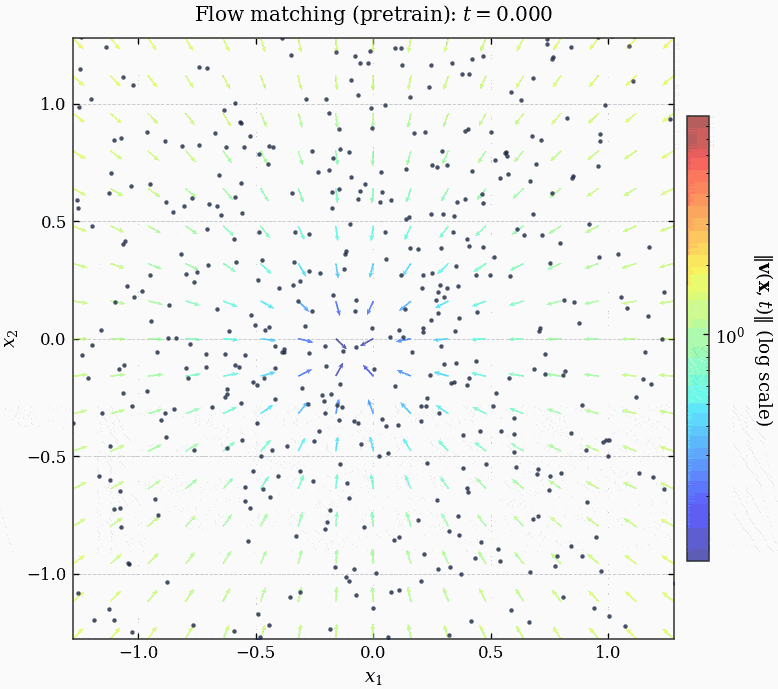
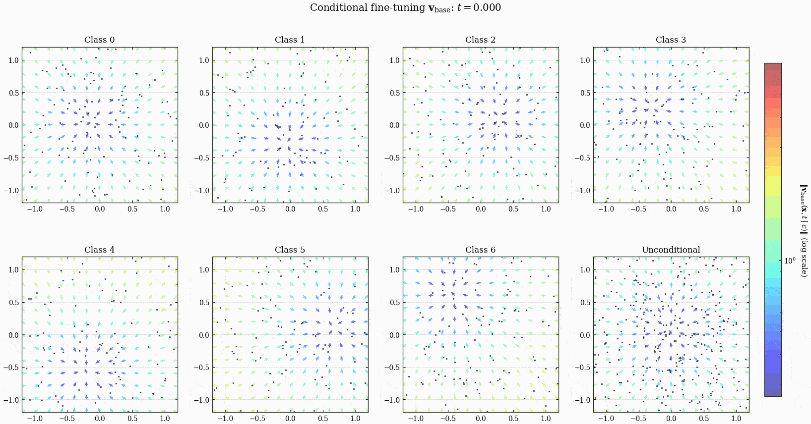
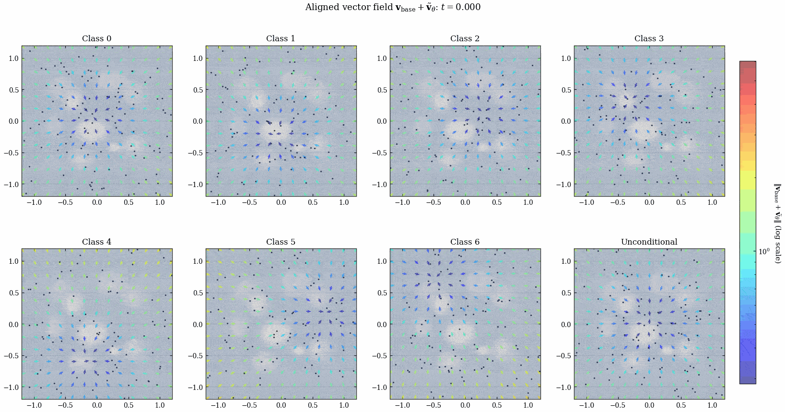
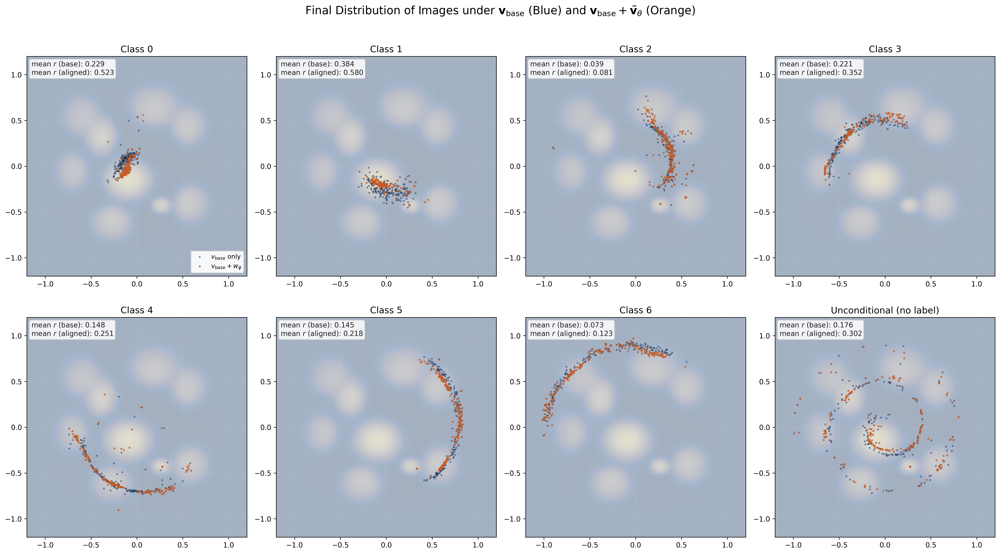

# smallflowmatching

## Intro

We perform flow matching on 2D images, including unconditional diffusion, conditional diffusion and alignment with a pre-defined reward model using RL, optimal control theory and PINNs. The code is heavily inspired by Prof. Z. Liu et al's [VGG-Flow](https://vggflow25.github.io) article.


## File Description

- `data.py`: Just some functions to return the Swissroll "Images" with or without labels. Also one function that returns Gaussian noise.
- `flow.py`: Some functions to return the tensors for training. For example, generate random times, generate target velocities, loss computation. Also one function that integrates the ODE from Gaussian noise to the data.
- `model.py`: Neural networks, including the unconditional model, conditional model, condition embedding layer, reward model, PINN model.

- `pretrain.ipynb`: Pretrain `MLPVelocity` model, and generate `pretrained_backbone.pt`.
- `finetune.ipynb`: Load `pretrained_backbone.pt` for finetuning `MLPVelocity` model (equivalent to training the `ConditionalMLPVelocity` model), and generate `conditioned_backbone.pt`.
    - `finetune-dropout-test.ipynb`: Test how different dropout probabilities affect the conditional and unconditional sampling distributions.
- `alignment.ipynb`: Align `ConditionalMLPVelocity` model with `Reward2D` reward model (involving training the `PINN` model).


## Usage

```bash
python pretrain.ipynb
python finetune.ipynb
python alignment.ipynb
```

## Results

### Pretraining



### Finetuning



### Alignment



